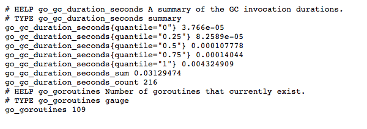
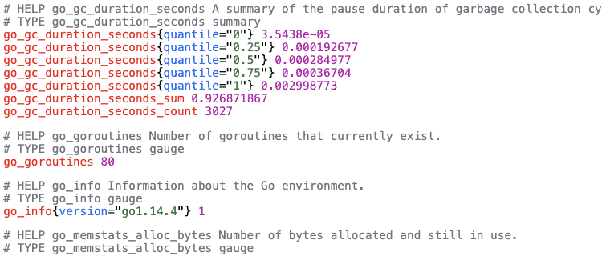

# Prometheus Formatter

Chrome Extension which makes plain Prometheus metrics easier to read.

###### before:

###### after:

## Installation

* clone/download this repo,
* open Chrome and go to `chrome://chrome/extensions/`,
* enable "Developer mode",
* click "Load unpacked extension",
* select the `extension` folder in this repo.

## License

[MIT](extension/LICENSE.txt)

